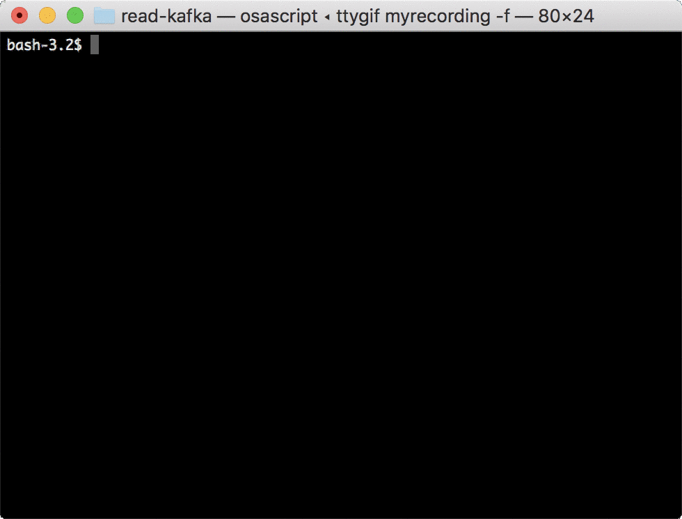

# read-kafka

Kafka sebagai messageing system. 

Apache Kafka® is a distributed streaming platform. What exactly does that mean?

## Terminologi
    
    1. Broker - single node apps kafka

    2. Topic - Like a Table in RDBMS

    3. Consumer - yang nerima message dari Broker, Client yang berfungsi mengkonsumsi data dari topik tertentu. 1 thread consumer hanya dapat mengkonsumsi 1 partisi dari 1 topik. 1 Consumer dapat memiliki beberapa thread consumer

    4 . Publisher - Client yang berfungsi mengirimkan data ke topik tertentu. Jika topik memiliki lebih dari satu partisi secara default data akan diisikan secara round robin namun producer dapat diatur untuk mengisi ke partisi tertentu dari suatu topic. 

    5. Replication Factor -  Seberapa banyak partiti itu di replkasi namun beda node. Fungsinya apa ?  

    6. Resilent Policy - Seberapa lama tersebut disimpan di kafka, jadi kafka itu sistemnya cuma ada append. makanya dia cepet, bisa sampe 2jt messegse/s. Resilent Policy adalah kapan data itu akan dihapus, 
    bisa seberapa lama atau seberapa besar.

    7. Consumer Grup -  Group dari consumer. Fungsinya untuk apa ? Satu Consumer Group dapat terdiri dari satu consumer atau lebih.  Satu Consumer Group akan mengkonsumsi data dari satu topik tertentu. 
    Satu data tertentu hanya akan dikonsumsi satu kali oleh satu consumer group dan akan dikonsumsi oleh satu consumer tertentu didalam consumer group tersebut (consumer yang berbeda didalam satu consumer group tidak akan memperoleh data yang sama). 

    8. Partition, Bagaimana data itu di pecah. misal ada 1TB, mau dipartisi jadi 2. maka jadinya 500GB dan 500GB. Fungsinya apa ? Partisi berfungsi untuk mendukung proses paralel. Jumlah partisi yang lebih besar dapat meningkatkan throughput namun mengkonsumsi resource lebih banyak.

## Requirment

    1. Zookeeper
    2. Java 
    3. Kafka

## Play with Kafka Single Node

### Instalation 

    1. Download from source code https://www.apache.org/dyn/closer.cgi?path=/kafka/1.0.1/kafka_2.11-1.0.1.tgz and extract

    2. Start Zookeeper --> bin/zookeeper-server-start.sh config/zookeeper.properties

    3. Start Kafka Single Node --> bin/kafka-server-start.sh config/server.properties

## Now Lets Play with kafka

    1. Create Topik 
        --> bin/kafka-topics.sh --create --zookeeper localhost:2181 --replication-factor 1 --partitions 1 --topic test

    2. Create Publisher 
        --> bin/kafka-console-producer.sh --broker-list localhost:9092 --topic test

    3. Create Consumer 
        --> bin/kafka-console-consumer.sh --bootstrap-server localhost:9092 --topic test --from-beginning

## wanna play with multi node kafka 

    Karena kita sudah membuat single node kafka, sekarang kita buat beberapa service kafka. 

    1. Make new Config file 

    > cp config/server.properties config/server-1.properties
    > cp config/server.properties config/server-2.properties

    2. edit config

        config/server-1.properties:
        broker.id=1
        listeners=PLAINTEXT://:9093
        log.dir=/tmp/kafka-logs-1
    ---------------------------------------
        config/server-2.properties:
        broker.id=2
        listeners=PLAINTEXT://:9094
        log.dir=/tmp/kafka-logs-2

## Now Lets Play with Kafka

    1. Create Topik
        > bin/kafka-topics.sh --create --zookeeper localhost:2181 --replication-factor 3 --partitions 1 --topic my-replicated-topic

    2. Create Publisher 
        > bin/kafka-console-producer.sh --broker-list localhost:9092 --topic my-replicated-topic

    3. Create Consumer
        > bin/kafka-console-consumer.sh --bootstrap-server localhost:9092 --from-beginning --topic my-replicated-topic

    
## Play With Kafka Docker  

 

